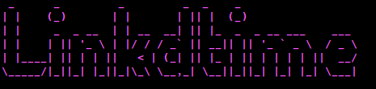
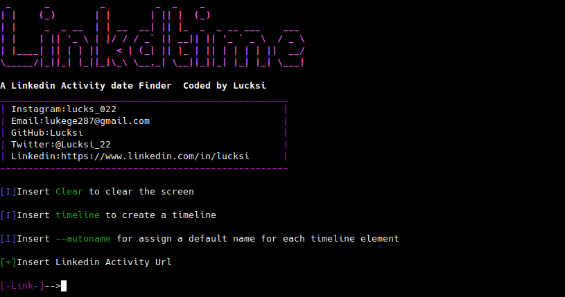
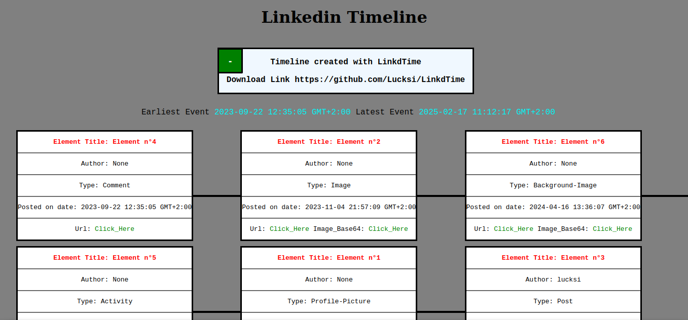

<p align = "center"></p>

<p align = "center">
  
  
  
  
  
  
</p>

## Introduction

**LinkdTime is a Timeline generator for Linkedin it can extract the exact date and time on a single post/comments or activity or generate a Timeline about a list of post/comments or activity**

## Screenshot:


## Requirements:
```
Python3
```

## Installation Linux:
```bash
sudo apt-get update
sudo apt-get install python3
sudo apt-get install git
git clone https://github.com/Lucksi/LinkdTime
```
## Execution:
```bash
cd LinkdTime
python3 main.py
```

## Operating Sytstems:

| Platform | Tested |
| ------------- | ------------- |
| Linux  | ✅ |
| Mac-Os  | ❌ |
| Windows | ❌ |


## Recognized Activities:
| Name
| -------------
| `Posts` 
| `Comments`
| `Comments/Replies`
| `Profile-Pictures Changes`
| `Background-Images Changes`
| `Company-Logo Changes`

## Current Features:
| Feauture list | Require Internet |
| ------------- | ----------------|
| `Extracting Activity timestamp`  | False
| `Create Timelines`|  False
| `Timezone Change` | False
| `Saving images in Base64 format (Timelines only)` | True
| `Download images (Timelines only)`| True

## Timeline Example:



## Configuration:
| Parameter Name | Values | Default Value |
| ------------- | ------------- | -------------|
| `DATE-FORMAT` | Eu/Us/As| Eu |
| `USER-AGENT` | input string | Mozilla/5.0 (Macintosh; Intel Mac OS X 10_11_5) AppleWebKit/537.36 (KHTML, like Gecko) Chrome/50.0.2661.102 Safari/537.36 |
| `AUTO-DOWNLOAD` | True/False| False |


## Advanced Commands:

| Option name | Description | Query Example |
| ------------- | ------------- | -------------|
| `timeline`  | Create a timeline from a group of activities| timeline test.txt |
| `--autoname`  | Generate a default name for each element in the timeline | timeline test.txt --autoname |
| `--description`  | Allows you to insert a description for each element in the timeline | timeline test.txt --description |
| `--save`  | Allows you to insert a description for each element in the timeline | timeline test.txt --media |
| `--download`  | Allows you to insert a description for each element in the timeline | timeline test.txt --download |
| `--timezone`  | Set a Timezone for the results (works with timelines and standalone links) (default GMT+2:OO) | timeline test.txt --timezone GMT+4:00 |

## Autoname Default element name example:
```bash
Element n°1
```

## Supported Timelines formats:
| Format Name | Extension 
| ------------- | -------------
| `Text File Format` | txt
| `Hyper Text Markup Language` | html


## STARGAZERS OVER TIME 

[](https://starchart.cc/Lucksi/LinkdTime)

<br>

## <p align = center>  ORIGINAL CREATOR: <a href = "https://github.com/Lucksi">LUCA GAROFALO (Lucksi)</a></p>


## <p align = center>LICENSE: GPL-3.0 License <br>COPYRIGHT: (C) 2025 Lucksi  
