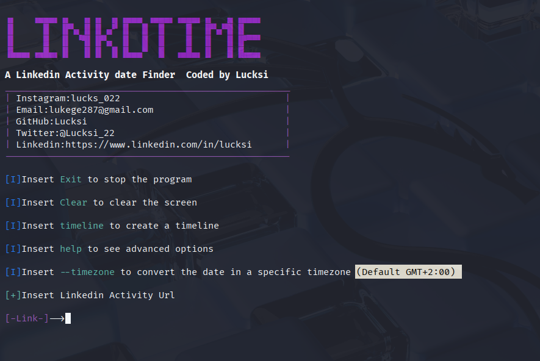

<p align = "center"></p>
<p align = "center">
  
  
  
  
  
  
</p>

## Introduction

**LinkdTime is a Timeline generator for Linkedin it can extract the exact date and time on a single post/comments or activity or generate a Timeline about a list of post/comments or activity**

## Screenshot:


## Requirements:
```
Python3
```

## Installation Linux:
```bash
sudo apt-get update
sudo apt-get install python3
sudo apt-get install git
git clone https://github.com/Lucksi/LinkdTime
```
## Execution:
```bash
cd LinkdTime
python3 main.py
```

## Operating Sytstems:

| Platform | Tested |
| ------------- | ------------- |
| Linux  | ✅ |
| Mac-Os  | ❌ |
| Windows | ❌ |

## Advanced Commands:

| Option name | Description | Query Example |
| ------------- | ------------- | -------------|
| `timeline`  | Create a timeline from a group of activities| timeline test.txt |
| `--autoname`  | Generate a default name for each element in the timeline | timeline test.txt --autoname |

## Autoname Default element name example:
```bash
Element n°1
```

## Supported Timelines formats:
| Format Name | Extension 
| ------------- | -------------
| `Text File Format` | txt


## STARGAZERS OVER TIME 

[](https://starchart.cc/Lucksi/LinkdTime)

<br>

## <p align = center>  ORIGINAL CREATOR: <a href = "https://github.com/Lucksi">LUCA GAROFALO (Lucksi)</a></p>


## <p align = center>LICENSE: GPL-3.0 License <br>COPYRIGHT: (C) 2025 Lucksi  
